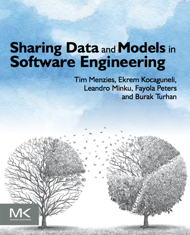
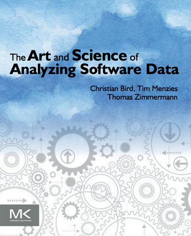
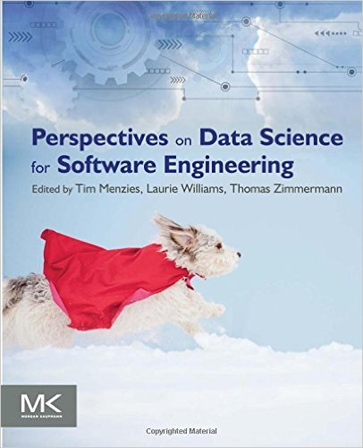

#  Curriculum Vitae

[Full details, 28 pages](pdf/MenziesCF.pdf). TL;DR? Then...

# Some stats:

**Funding**

+ $8M in [research funding](https://docs.google.com/spreadsheets/d/1Y5YrD3WkZlee7LLXLN5m9vvMPL2qBU-vruHpRr77dqg/edit#gid=676744746make%20-)
+ Funding from  NSF, NIJ, DoD, NASA, NARA, USDA, LEXIS NEXIS, GRAMMATECH

**Grad students:**

+ 8 + 23 graduated [Ph.D. + masters](https://docs.google.com/spreadsheets/d/1oWGEfEdt4aXZ_chBLTzw2RkKhGTKIKReetkcb8Zo2F4/edit?usp=sharing) 
+ 12 + 1 current Ph.D. + masters;

**Editorial boards:**

+ TSE, EMSE, IST, ASE, SQJ, Big Data journal

**Conference**

+ **co-General chair:** ICMSE'16
+ **co-PC-chair:** SSBSE'17, ICSE NEIR'15, ASE'12
+ **PCs:**  ICSE'18, EASE'17, ASE'16, ISSRE'16, SSBSE'16, BIGDSE'16, PROMISE'16
+ **PCs, before:** ICSE, ASE, FSE, ISSRE, HASE, SSBSE, EASE, MSR, RAISE, etc, etc

**Papers:**

+ 250+ refereed [research papers](https://scholar.google.com/citations?user=7htTUTgmLtUC&hl=en&oi=ao);
+ h-index = 41

**Books:**

 &nbsp;&nbsp;

# Short bio

Tim Menzies (Ph.D., UNSW, 1995) is a full Professor in CS at North Carolina
State University where he teaches software engineering, automated software
engineering, and foundations of software science. He is the directory of the
[RAISE lab](http://ai4se.net/) (real world AI for SE).  that explores SE, data
mining, AI, search-based SE, and open access science.

He is the author of over 250 referred publications and editor of three recent
books summarized the state of the art in software analytics.  In his career, he
has been a lead researcher on projects for NSF, NIJ, DoD, NASA, USDA, as well as
joint research work with private companies. For 2002 to 2004, he was the
software engineering research chair at NASA's software Independent Verification
and Validation Facility.

Prof. Menzies is the co-founder of the PROMISE conference series devoted to
reproducible experiments in software engineering
([http://openscience.us/repo](http://openscience.us/repo)). He is an associate
editor of IEEE Transactions on Software Engineering, Empirical Software
Engineering, the Automated Software Engineering Journal the Big Data Journal,
Information Software Technology, and the Software Quality Journal. In 2015, he
served as co-chair for the ICSE'15 NIER track. In 2016, he serves as co-general
chair of ICMSE'16. For more, see his vita
([http://goo.gl/8eNhYM](http://goo.gl/8eNhYM)) or his list of publications
[https://goo.gl/qNQAIq](https://goo.gl/qNQAIq)) or his home page
[http://menzies.us](http://menzies.us).
