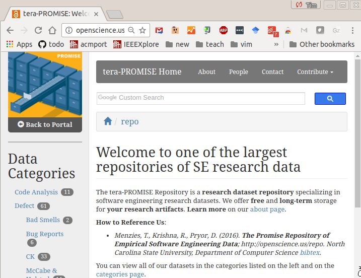
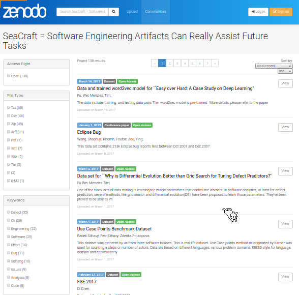

# Thanks to the MSR'17 Award Committee, (and Many Others as Well!)

This evening I learned that I was the winner of the inaugural Mining
Software Repositories Foundational Contribution Award. 
According to the award web site, the award is a recognition of fundamental
contributions in the field of mining software repositories, which
helped others
to advance the state of the art.  
I was nominated for my work on the
PROMISE repository 
[http://openscience.us/repo](http://openscience.us/repo). 

I want to thank the committee for the award
and I'd like to
dedicate the award to 
the many people whose hard work
made the PROMISE repo possible:

- **Jelber Sayyad** was my original partner in PROMISE. Together, we
  had the idea in 2004 that SE analytics papers should not only 
  report their results, but also share the data used to achieve those results.
  Accordingly we started the PROMISE conference series and an associated repo.
- **Gary Boetticher** worked on the PROMISE conference (and offered advice
  on the repo) till 2009. He was very influential in those
  early days and PROMISE (repo or conference) would not have lasted past its infancy without
  his diligent efforts.
- **Tom Ostrand** and **Elaine Weyuker** were very important to the development of
  the PROMISE conference. The 2005 PROMISE conference meeting was somewhat low energy and
  Gary and I were considering cancelling the whole thing. But in 2006,
  Tom and Elaine joined our community, injecting much needed energy and
  credibility to our meetings.  Tom also performed some magic with the ACM Digital
  Library and, hey presto, suddenly all the PROMISE conference papers become ACM publications.
- Numerous other researchers were kind enough to lend their talents
  to the organization of  the conferences.  That list of people
  is very long and including **Ayse Bener, Guenther Ruhe, Stefan Wagner, Ye Yang**
  (and many others, besides).
- Finally, over the years, a small army of students worked on the repo:
  
     - These students regularly scoured the table of contents of SE recent conference proceedings
  to find new data for PROMISE.
     - Many of those former students 
  how have Ph.D.s:
  **Greg Gay**, **Ekrem Kocaguneli**,
  **Joe Krall**,  **Fayola Peters**, 
  and **Burak Turhan**. I hope the
  connections they made while working on
  PROMISE will help them in their future careers.
     - As to more recent students, special thanks
  are due to **Rahul Krishna** for curating
  the current version of PROMISE;
  **Mitch Rees-Jones** for the large scale redesign of the repo web-site in 2014; and **David Pryor**
  for many things including all the work
  with ZENODO (see below).

## Why PROMISE?

In this era of Github, GHtorrent, et al. it is hard to recall that only a decade ago, it was
difficult to access project data. Nevertheless, that was the case.

Back in 2005
many people in the MSR field were analyzing large amount of (public) open
source data but kept the tools and processed datasets to themselves as it was often
considered a competitive advantage. In fact, within the MSR
community, it was not until 2013 that they started
their Data Showcase track to encourage sharing of data. 

Meanwhile, back in 2005,
I started the PROMISE workshop 
with **Jelber Sayyad** 
that
"encouraged" data
sharing. I put "encouraged" in quotes, because it actually was a very explicit requirement.
Here are part of the 2005 call for papers for PROMISE, which put the following text in all caps:

- "SUBMISSIONS WHICH
INCLUDE EMPIRICAL RESULTS BASED ON PUBLICLY ACCESSIBLE DATASETS WILL BE GIVEN
THE HIGHEST PRIORITY” 
- “A COPY OF THE PUBLIC DATASETS USED IN THE ACCEPTED
PAPERS WILL BE POSTED ON THE PROMISE SOFTWARE ENGINEERING REPOSITORY.
THEREFORE, IF APPLICABLE, THE AUTHORS SHOULD OBTAIN THE NECESSARY PERMISSION
TO DONATE THE DATA BEFORE SUBMITTING THEIR PAPER." 

This emphasis in shared and repeatable results was  unthinkable at that
time and many people predicted that PROMISE would not last long. Tee hee. We proved them wrong.
The PROMISE workshop soon grew into its own stand-alone  conference.
Due to
some cosmic quirk of scheduling, the PROMISE and
MSR conferences
often meet at the same time, in
the same corridor, sometimes even in the next room. But both events had full schedules
so we rarely made it to each other sessions.
Hence, the conferences evolved differently.
The following is Prem Devanbu's  attempt to capture
the differences  (and to misquote George Box, he hopes his model is more useful than it is
wrong):

- For the most part, the MSR community was mostly concerned with the initial
collection of data sets from software projects.
-  Meanwhile, the PROMISE community emphasized the analysis of the data after
it was collected.

Now it is true that 
most MSR people analyzed their data with statistics
and ML, and many PROMISE people did spend time in data collection.
But where the PROMISE conferences was different and unique
was its analysis of the analysis of data. 
According to 
Robles et
al. at MSR'10 paper,
most MSR papers were not concerned with
a repeated analysis of data explored by a prior paper. On the other hand, the
PROMISE people routinely posted all their data on a public repository and their new
papers would re-analyze old data, in an attempt to improve that analysis. 

Since 2011, PROMISE stopped scheduling itself at the same time as MSR.
This has lead to richer
interactions between MSR and PROMISE people. Hence, as time passes, the
directions of these two conferences grow less distinct. Today, MSR meets at ICSE
and PROMISE meets at ESEM and both events draw international leaders in the field
of software data science.

So just to be clear, the "PROMISE project" has two parts:

- a repo;
- an annual conference called "PROMISE", that is currently co-located with ESEM.

This award was given to me for my work on the repo.
As to the conference,
Initially, that conference was  tightly connected to the repo (to store the data from papers from the conference).
Since then, the scope of the repo has extended to include data from many sources.

As to the PROMISE conference, I was its steering committee chair till 2012 when **Stefan Wagner** was kind enough
to take on those duties. 
These days, is guided
by its dedicated and talented steering committee
**Leandro Minku**, 
**Andriy Miranskyy**, 
**Massimiliano Di Penta**, 
**Burak Turhan**, 
and **Hongyu Zhang**.

## Results from PROMISE

Here's a sample of what was achieved with PROMISE (and if anyone wants to add to this list, just
email me at tim@menzies.us):

- At the time of this writing, the 
PROMISE repository includes sharable data on defect prediction,
  effort estimation, model-based SE, requirements models, performance
  prediction, over 240,000 real-world spreadsheets (one of the largest
  collections ever assembled), and many other kinds of data as well.
- The early focus of PROMISE was on effort
estimation and defect prediction.
One of the landmark results here was documenting the
business case for the value of such predictors.
For example, [Misirli et al.]([200~http://www.aaai.org/ojs/index.php/aimagazine/article/viewFile/2348/2216/)
report studies where the guidance offered by
defect predictors (a)reduced the effort required for
software inspections in some Turkish software companies by
72%;
(b)while, at the same time, still being able to find the 25% 
of the files that
contain 88% of the defects. 
- The repo
not only greatly influenced
effort estimation and defect prediction, but also the field of vulnerability prediction.
Several recent state of the art papers in that field
use methods first widely described in the process of
PROMISE data.
- The first examples of successful cross-project learning in defect prediction and effort
estimation came from work on PROMISE data.
 Working with **Burak Turhan** and **Ayse Bener**, we used PROMISE data to write a top-ten-
most-cited EMSE paper (2009 to 2014) on how to share data between projects (see
"[On the relative value of cross-company and within-company data for defect prediction](http://cs.gmu.edu/~offutt/classes/see/papers/turham2009.pdf)", EMSE 2009).
- More recent uses of PROMISE include work in software sharing and privacy. Many
researchers have reported that as data is anonymized (for privacy purposes), it
becomes harder to make conclusions from that data. Using PROMISE data, my Ph.D.
student, **Fayola Peters**,
showed that it is possible to share privatized versions of data that
hide details about individual projects, while at the same time allowed researchers to
build effect predictors for SE quality attributes (see "[Better privacy-preserving data sharing for cross project defect prediction](https://lucas.ezzoterik.com/wp-content/uploads/2016/03/15lace2.pdf)", ICSE’15).

## Reviewer Comments

I need to also thank my nominees for their
kind words about PROMISE. The following are quotes from those letters.

- "I don't think any other contribution that is
even remotely comparable to (PROMISE)."
- "There are many factors that lead to the state-of-the-art
in mining software repositories, ... sharing and replicability in
the science of software engineering, but in my opinion, none played
a greater role than the PROMISE repository, created by Tim Menzies."
- "I can’t think of a stronger
contribution right now (to MSR), except maybe the creation of the MSR
community by Dr. Hassan."
- "PROMISE makes research results reproducible. For example, according to Robles et
al. at MSR 
2010, they found that over 95% of 171 papers published at MSR were
unreproducible, since 
their associated data was no longer on­line. However, nearly all of the
papers at the PROMISE 
conference was reproducible since they were based on PROMISE data. I believe
this is a really 
significant contribution. "
- "Prof. Menzies has enabled and inspired a generation of
  SE data scientists to use data to make refutable results. In his own
publications, he makes extensive use of PROMISE data with the express
aim of challenging others to share their data and/or repeat/improve/
or refute his own results. 
For example,
his 2007 TSE article 
"[Data Mining Static Code Attributes to Learn Defect
Predictors](https://www.researchgate.net/profile/Tim_Menzies/publication/3189767_Problems_with_Precision_A_Response_to_Comments_on_'Data_Mining_Static_Code_Attributes_to_Learn_Defect_Predictors'/links/0912f50c0549e3cb3d000000.pdf)"
contains
numerous interesting research contributions. But  much of
the paper reads like a "how to" guide on software
analytics. All its data was placed on­line at PROMISE.
This paper is widely cited, to say the least: 770
citations since 2007; most cites per year for any
TSE paper since its publication; one the top­100
most cited papers anywhere in the history of SE
(see
[http://dl.acm.org/citation.cfm?id=2874005](http://dl.acm.org/citation.cfm?id=2874005)).
That paper ends with following paragraph:<ul>
<em>Our hope
is that numerous researchers repeat our experiments
and discover learning methods that are superior to the
one proposed here. Paradoxically, this paper will be a
success if it is quickly superseded.</em>
</ul>
I find this paragraph inspirational, a shining example
of how to do open science in the Internet age.
Here Dr. Menzies is pleading with the international
research community to out­perform his own publication.
Further, by placing all the materials for this paper
on­line at PROMISE, he is enabling other researchers
to refute his work, if they can."

## The Future of the PROMISE Repository

Now that PROMISE 
repository
has achieved international
recognition,  it is strange to report that  the repo is being
decommissioned. 

The ZENODO repo at the CERN Large Hadron Collider 
offers many services that significantly extend what PROMISE can offer:

- It happily accepts files of up to 50GB. 
- It auto-assigns DOIs (digital object identifiers) to all files.
- And if any Github repo is registered at ZENODO, then whenever
  a new release if tagged in Git, ZENODO automatically grabs a zip copy
  of the newly released file.

Accordingly, we have nearly finished moving all the PROMISE data over 
to the 
ZENODO repo called SEACRAFT  ([Software Engineering Artifacts Can Really Assist Future Tasks](http://tiny.cc/seacraft)).
In future, if anyone wants a long-term storage
facility for data, or scripts in Github, please submit 
to [https://zenodo.org/deposit/new?c=seacraft](https://zenodo.org/deposit/new?c=seacraft).

